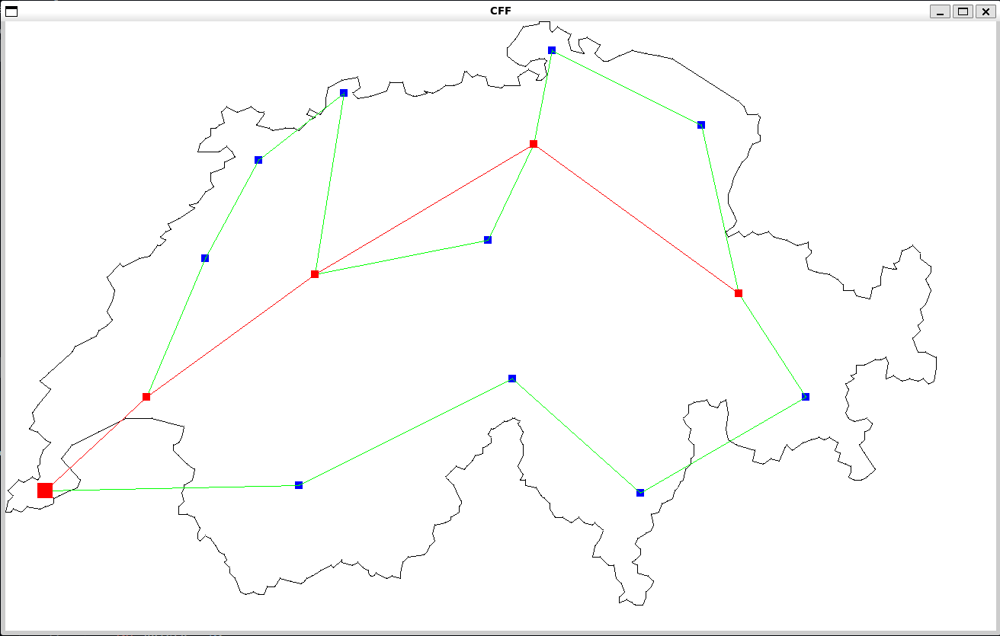
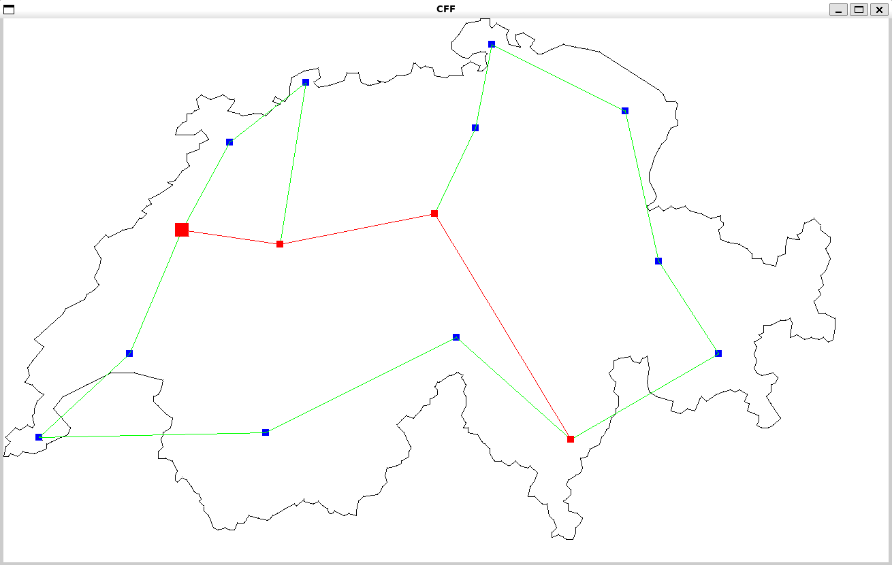

# tp17 - Soufiane El kharmoudi
# Recherce du plus court chemin dans un réseau ferré

### Voici les commandes pour exécuter le programme:
### Se déplacer dans le dossier src :

```c
make clean && make
make run
```
### Exemple de fonctionnement:


# Geneve -> Coire



# Neuchatel -> Bellinzone



# Petite description

1. Impression correcte du trajet avec les noms des villes
2. Impression correcte des minutes du trajet
3. J’ai créé la fonction d’erreur de saisie de la ville
4. Connexions entre les cités de couleur verte
5. Trajet de couleur Rouge
6. Ville de départ avec le plus grand carré par rapport aux autres villes
7. Itinéraire avec changement de couleur du cadre en rouge pour mieux identifier le trajet 
8. Lorsque je cherche un itinéraire, je peux décider d’imprimer la carte ou non, même si j’imprime la carte, je peux effectuer une autre    recherche et mettre à jour la carte.
9. Gestion correcte du mode "Quitter"

# Erreurs

1. Manque à gérer la mémoire d’enfiler, même si j’ai fait le free en parcourant la liste, il me marque encore une erreur
2. Les liaisons en vert entre les villes dans l’impression de la carte ne sont pas entièrement complètes.Cependant, les liaisons entre les villes de départ et d’arrivée sont exactes

# Merci beaucoup pour le cours et pour l’enseignement que vous nous avez donné. 
